# AR-repository-architecture: Native Build Tools repository architecture

This is the structural map of Native Build Tools: what the major components are, how they fit
together, how deployment and repository-wide infrastructure fit into the product, and how a
change flows from implementation to verified Gradle and Maven plugin artifacts. Component
functional specifications own product behavior; component architecture specifications own
implementation boundaries.

## 1. What the repository is

Native Build Tools is a composite Gradle workspace that produces two build-tool plugins and the
shared libraries those plugins use to invoke GraalVM Native Image, run native tests, manage
metadata, and keep Gradle and Maven behavior aligned. The repository also owns samples,
functional-test fixtures, user documentation, CI, and release infrastructure.

The product plugins are the externally visible deliverables. Shared libraries hold cross-cutting
Native Image behavior. Samples, fixtures, documentation, and infrastructure support development
and verification without becoming product API.

## 2. Components

| Component | Paths | Role | Spec |
| --- | --- | --- | --- |
| Gradle product plugin | `native-gradle-plugin/` | Gradle plugin API, DSL, tasks, command-line providers, Gradle functional tests, and Gradle publication metadata. | §gradle/FS-gradle-plugin, §gradle/AR-gradle-plugin |
| Maven product plugin | `native-maven-plugin/` | Maven mojos, plugin descriptor generation, Maven configuration objects, Maven functional tests, SBOM behavior, and issue reproducers. | §maven/FS-maven-plugin, §maven/AR-maven-plugin |
| Shared libraries | `common/utils/`, `common/graalvm-reachability-metadata/`, `common/junit-platform-native/` | Build-tool-neutral Native Image utilities, metadata repository lookup, resource analysis, agent modes, and JUnit native runtime support. | §common/FS-common-libraries, §common/AR-common-libraries |
| Native tests, samples, and fixtures | `samples/`, `test-support/`, plugin `src/functionalTest/`, plugin `src/testFixtures/`, `native-maven-plugin/reproducers/` | Realistic projects and reusable test artifacts that verify plugin behavior. | §FS-native-tests, §AR-build-infrastructure.4 |
| Build infrastructure | `build-logic/`, root Gradle files, `gradle/`, `config/`, `schemas/` | Repository conventions, aggregation, publication, validation, schemas, and generated support artifacts. | §FS-build-infrastructure, §AR-build-infrastructure |
| CI workflows | `.github/workflows/`, `.github/actions/` | Pull request gates, dev-build checks, documentation deployment, snapshot deployment, and shared action setup. | §AR-pull-request-ci, §AR-deploy-documentation, §AR-deploy-snapshots |
| User and maintainer docs | `docs/`, `README.md`, `DEVELOPING.md`, `AGENTS.md` | User guides, changelog, and developer guide stay user-facing; grounded maintainer specification lives in `docs/spec/` and `AGENTS.md`. | §FS-build-infrastructure.3 |

The grund scan follows the maintainer specification, workflow, source-comment, sample, and
build-logic surfaces. User-facing guides do not need citations unless they intentionally make a
maintainer-facing claim.

### Change map

```mermaid
flowchart TD
    SharedBehavior["Behavior shared by Gradle and Maven"] --> PluginCommon["docs/spec/functional/plugin-common.md"]
    GradleBehavior["Gradle DSL/task behavior"] --> GradleSpec["native-gradle-plugin/docs/functional-spec.md"]
    MavenBehavior["Maven goal/XML behavior"] --> MavenSpec["native-maven-plugin/docs/functional-spec.md"]
    CommonBehavior["Resources, metadata, agent, utilities"] --> CommonSpec["common/docs/functional-spec.md"]
    NativeTests["Native test lifecycle"] --> PluginCommon["docs/spec/functional/plugin-common.md"]
    Fixtures["Samples, fixtures, reproducers"] --> BuildArch["docs/spec/architecture/build-infrastructure.md"]
    BuildInfraStructure["Build infrastructure boundaries"] --> BuildArch["docs/spec/architecture/build-infrastructure.md"]
    BuildInfraBehavior["Build, docs, release, generated artifacts"] --> BuildSpec["docs/spec/functional/build-infrastructure.md"]
    CIWork["Pull request gates and actions"] --> CISpec["docs/spec/architecture/ci.md"]
```

## 3. Dependency direction

Repository boundaries are enforced by dependency direction rather than by identical module shapes
for Gradle and Maven. Product plugins may depend on common modules for Native Image command-line
utilities, metadata repository behavior, resource analysis, schema validation, and native test
support. Common modules must not depend on Gradle or Maven plugin implementation classes. If
common code needs build-tool state, product plugins convert it into plain Java values before
calling common APIs.

Build and CI infrastructure may depend on product modules to assemble, test, publish, or document
them. Product runtime code must not depend on infrastructure implementation classes. Fixtures may
depend on product artifacts under test and support artifacts from `test-support/`, but they should
not be used as shared runtime libraries for product code.

## 4. How work flows through the system

1. A behavior change starts in the most specific component spec: §FS-plugin-common-behavior for
   behavior shared by both product plugins, §gradle/FS-gradle-plugin for Gradle,
   §maven/FS-maven-plugin for Maven, §common/FS-common-libraries for shared library behavior,
   §FS-native-tests for native-test behavior,
   §FS-build-infrastructure for build and release infrastructure, or
   §AR-build-infrastructure.4 for sample, fixture, and reproducer ownership.
2. Product or common code implements the behavior with citations to the component section that
   owns it. Java source comments use marked `§<ID>` citations; Checkstyle allows `§` as the only
   non-ASCII citation exception.
3. Unit tests, functional tests, and samples validate the changed behavior locally through the
   commands specified by §gradle/E2E-gradle-plugin-functional-tests,
   §maven/E2E-maven-plugin-functional-tests, and §FS-native-tests.6.
4. Pull request CI runs the matching workflow gates from §AR-pull-request-ci and validates grund
   citations through §AR-check-grund-spec.
5. Release and snapshot infrastructure publishes the externally visible plugin artifacts only
   through the repository's build and CI boundaries (§FS-build-infrastructure.5).

## 5. Specification layout

The top-level `architecture/` directory describes repository-wide structure, ownership,
deployment, CI workflow boundaries, and build-infrastructure boundaries. The top-level
`functional/` directory states repository-wide observable product and infrastructure behavior,
including behavior expected from both product plugins and maintainer-facing build tasks. The common,
Gradle, and Maven components own workspace member specs under
`common/docs/`, `native-gradle-plugin/docs/`, and `native-maven-plugin/docs/`.
In every location, `functional-spec.md` states externally observable behavior, user workflows,
build-tool contracts, metadata behavior, and verification expectations; `architecture.md` states
module ownership, dependency direction, internal structure, and implementation responsibilities.
Code, tests, YAML, and scripts should cite the most specific component or workflow section that
justifies the behavior.
