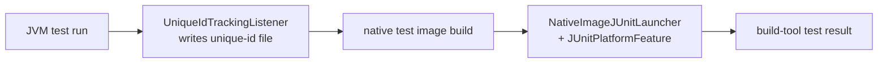

# FS-native-tests: Both plugins compile and execute JUnit tests as a native image

Both product plugins must take an ordinary JVM JUnit Platform test setup and produce a native
test binary that executes the same selected tests. The user keeps writing standard JUnit tests; the
plugin builds a native image of those tests and runs it. A failing native test executable must
fail the build in both tools. This contract realizes the native-test slice of
[§GOAL-plugin-parity](../goals.md#goal-plugin-parity-shared-native-image-behavior-remains-consistent-across-gradle-and-maven) and is adapted by [§gradle/FS-native-tests](../../../native-gradle-plugin/docs/functional/native-tests.md#fs-native-tests-gradle-tasks-compile-and-run-native-junit-tests) and
[§maven/FS-native-tests](../../../native-maven-plugin/docs/functional/native-tests.md#fs-native-tests-maven-goals-compile-and-run-native-junit-tests).

| Concern | Shared owner | Build-tool owner |
| --- | --- | --- |
| Test class and resource registration | `common/junit-platform-native` (`JUnitPlatformFeature`) | plugin supplies test classpaths and resource roots |
| Native launcher | `NativeImageJUnitLauncher` (entry point in the native test image) | task/goal executes the binary, maps exit code to build result |
| Test selection | shared unique-id file format | plugin runs the JVM test to produce that file |
| Skip and lifecycle behavior | shared skip concepts (skip image, skip execution) | build-tool-specific flags and task/goal selection |
| Compatibility mode | shared mode semantics ([§GLOSS-compatibility-mode](../glossary.md#gloss-compatibility-mode-native-image-compatibility-mode)) | plugin detects compatibility mode from build args |

## 1. Two-phase lifecycle

Native test support runs in two phases:

1. **Collect.** A JVM test run records the selected JUnit Platform unique IDs to a known output
   directory using `org.junit.platform.launcher.listeners.UniqueIdTrackingListener`. Both plugins
   must arrange JVM test execution to write this file before native test compilation.
2. **Build and run.** The native test image build consumes the unique-id file, compiles the test
   image with compiled test classes, test resources, the test runtime classpath, JUnit Platform
   dependencies, and `common/junit-platform-native`, then executes that binary unless execution
   is explicitly skipped.

The build-tool plugin must run the native test binary after compilation by default. Skipping image
execution requires an explicit plugin setting.

## 2. Test discovery and registration

Native Image cannot rely on runtime reflection and resource scanning for test discovery, so the
following must happen during image build:

- `JUnitPlatformFeature` ([§common/FS-common-libraries.3](../../../common/docs/functional-spec.md#3-native-image-tracing-agent) via Native Image `Feature` API) must
  register every test class identified by the JVM run, plus the JUnit Platform engine classes,
  reporting classes, and `NativeImageJUnitLauncher` itself.
- The image must include the test resources the JVM test run would see.
- Provider classes for JUnit Platform, Jupiter, and Vintage must contribute their Native Image
  metadata when the corresponding engine is on the test classpath. New providers may be added
  when the repository supports new JUnit Platform behavior.
- When Jupiter extension autodetection is enabled, service-registered
  `org.junit.jupiter.api.extension.Extension` providers must be available to the native test image.

The repository's native-test fixtures cover nested tests, method sources, CSV sources, enum
sources, converters, aggregators, class ordering, display-name generation, and service-registered
Jupiter extensions. The shared launcher and feature must preserve JUnit Platform semantics for
any scenario the repository's fixtures exercise.

## 3. Native launcher and feature

`org.graalvm.junit.platform.NativeImageJUnitLauncher` is the test image entry point. It must
refuse to run outside a native-image-compiled test executable, build a JUnit Platform
`LauncherDiscoveryRequest` from the recorded unique IDs, run the platform `Launcher`, and exit
with a process status that the build-tool plugin treats as the native test outcome. It must also
write a legacy XML report under `test-results-native/test` (overridable with `--xml-output-dir`).

`org.graalvm.junit.platform.JUnitPlatformFeature` is the Native Image build-time feature that
registers everything the launcher needs at run time. Both classes are owned by
`common/junit-platform-native`.

## 4. Build-tool adapters

Both adapters must expose the native test lifecycle through their build-tool-native surface,
assemble test classes, resources, dependencies, and selected test identifiers, honor the build
tool's normal test-skip concepts, and let users pass runtime arguments to the native test
executable. Runtime arguments must not affect image generation.

Gradle-specific task wiring is specified by [§gradle/FS-native-tests](../../../native-gradle-plugin/docs/functional/native-tests.md#fs-native-tests-gradle-tasks-compile-and-run-native-junit-tests). Maven-specific goal
behavior is specified by [§maven/FS-native-tests](../../../native-maven-plugin/docs/functional/native-tests.md#fs-native-tests-maven-goals-compile-and-run-native-junit-tests).

## 5. Compatibility mode

When the native test image is built with Native Image compatibility mode
([§GLOSS-compatibility-mode](../glossary.md#gloss-compatibility-mode-native-image-compatibility-mode)), the test launcher path changes. Adapters must detect compatibility
mode from the configured build arguments or Native Image options environment available to them.

- **Compatibility mode detected:** the test image may use JUnit's standard `ConsoleLauncher`. The
  adapter must not add `NativeImageJUnitLauncher` state that would conflict with the standard
  launcher path.
- **Compatibility mode not detected:** the adapter must use `NativeImageJUnitLauncher` and
  `JUnitPlatformFeature`.

## 6. Verification surface

`common/junit-platform-native` must contain JUnit-focused unit tests for launcher, feature,
unique-id collection, and provider behavior. Both plugins' functional test suites must cover at
least: application-with-tests, standalone JUnit, multi-project, Kotlin tests where the build tool
supports them, custom source sets where supported, no-test (zero-test-class) behavior, and
compatibility-mode coverage. Scenario ownership is [§AR-build-infrastructure.4.1](../architecture/build-infrastructure.md#41-fixture-groups).
