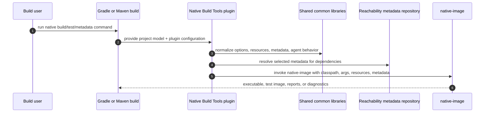

# FS-plugin-common-behavior: Gradle and Maven expose aligned Native Image plugin behavior

Native Build Tools gives Java build users a build-tool-native path to GraalVM Native Image. The
Gradle and Maven plugins use different build models, but they should answer the same practical
questions: build a native executable, run it, test it, supply metadata, inspect missing metadata,
and collect tracing-agent output. This functional contract is the parity boundary; the detailed
shared behavior lives in the sibling specs below. It realizes
§GOAL-plugin-parity and is implemented by §gradle/FS-gradle-plugin
and §maven/FS-maven-plugin with shared primitives from §common/FS-common-libraries.

## Reader View

| User goal | Gradle shape | Maven shape | Shared spec |
| --- | --- | --- | --- |
| Build the main application image | `./gradlew nativeCompile` from `graalvmNative.binaries.main` | `mvn -Pnative package` with `compile-no-fork`, or `mvn -Pnative native:compile` | §FS-native-image-builds |
| Run the application image | `./gradlew nativeRun` | execute the generated binary directly or through project `exec` configuration | §FS-native-image-builds |
| Build and run tests as a native image | `./gradlew nativeTest` | `mvn -Pnative native:test` or a lifecycle-bound `test` execution | §FS-native-tests |
| Generate resource configuration | `generateResourcesConfigFile` and derived binary tasks | `native:generateResourceConfig` / `native:generateTestResourceConfig` | §FS-resources-and-metadata.1 |
| Use reachability metadata | metadata repository DSL plus native compile tasks | `<metadataRepository>` plus metadata goals/native compile goals | §FS-resources-and-metadata.2 |
| Inspect missing metadata | `listLibrariesMissingMetadata` | `native:list-libraries-missing-metadata` | §FS-resources-and-metadata.3 |
| Collect agent output | `-Pagent` or DSL agent configuration, then `metadataCopy` | `-Dagent=true` or XML agent configuration, then `native:metadata-copy` | §FS-tracing-agent-workflows |

## 1. Capability parity

Both product plugins must support the following capabilities unless the build-tool model makes the
capability impossible or intentionally different:

- native image builds (§FS-native-image-builds)
- native test compilation and execution (§FS-native-tests)
- Native Image executable discovery and command-line assembly (§FS-native-image-builds.2, §FS-native-image-builds.3)
- argument-file handling (§GLOSS-argument-file)
- resource configuration generation (§FS-resources-and-metadata.1)
- reachability metadata repository consumption (§FS-resources-and-metadata.2)
- missing metadata reports (§FS-resources-and-metadata.3)
- dynamic access metadata (§FS-resources-and-metadata.4)
- Native Image tracing-agent modes and merge/copy workflows (§FS-tracing-agent-workflows)
- schema validation (§FS-resources-and-metadata.5)
- Native Image version-dependent behavior (§FS-native-image-builds.4)
- predictable option precedence (§FS-option-precedence)

When a capability is intentionally different between Gradle and Maven, the product-specific specs
must explain the difference at the point where each plugin adapts this common contract.
Differences should follow the build tool's normal user experience rather than inventing a
cross-tool abstraction that feels natural in neither tool.

## 2. Verification surface

Parity must be verified by shared samples, product functional tests, and common module tests.
Product functional tests should cover the same scenario families in both build tools where
possible; product-specific tests cover behavior that only one build tool can express. The plugin
end-to-end execution contracts are §gradle/E2E-gradle-plugin-functional-tests and
§maven/E2E-maven-plugin-functional-tests; fixture ownership is §AR-build-infrastructure.4.

When a new capability is added to one plugin, the implementation should either add the equivalent
capability to the other plugin, cite the existing matching behavior, or explicitly document why
the other build tool cannot or should not expose it.
