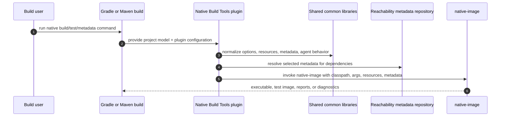
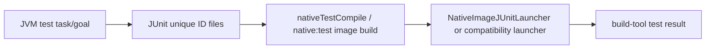

# FS-plugin-common-behavior: Gradle and Maven expose aligned Native Image plugin behavior

Native Build Tools gives Java build users a build-tool-native path to GraalVM Native Image. The
Gradle and Maven plugins use different build models, but they should answer the same practical
questions: how do I build a native executable, run it, test it, supply metadata, inspect missing
metadata, and collect tracing-agent output? This product-level functional contract is about that
shared behavior, not the architecture of the `common/` implementation modules.

It realizes §GOAL-shared-native-image-behavior-stays-consistent and is implemented by
§gradle/FS-gradle-plugin and §maven/FS-maven-plugin with shared primitives from §FS-common-libraries.

## Reader View

| User goal | Gradle shape | Maven shape |
| --- | --- | --- |
| Build the main application image | `./gradlew nativeCompile` from `graalvmNative.binaries.main` | `mvn -Pnative package` with `compile-no-fork`, or `mvn -Pnative native:compile` |
| Run the application image | `./gradlew nativeRun` | execute the generated binary directly or through project `exec` configuration |
| Build and run tests as a native image | `./gradlew nativeTest` | `mvn -Pnative native:test` or a lifecycle-bound `test` execution |
| Generate resource configuration | `generateResourcesConfigFile` and derived binary tasks | `native:generateResourceConfig` / `native:generateTestResourceConfig` |
| Use reachability metadata | metadata repository DSL plus native compile tasks | `<metadataRepository>` plus metadata goals/native compile goals |
| Collect agent output | `-Pagent` or DSL agent configuration, then `metadataCopy` | `-Dagent=true` or XML agent configuration, then `native:metadata-copy` |
| Inspect missing metadata | `listLibrariesMissingMetadata` | `native:list-libraries-missing-metadata` |

## 1. Capability parity

Both product plugins must support native image builds, native test compilation and execution,
Native Image executable discovery, command-line assembly, argument-file handling, resource
configuration generation, reachability metadata repository consumption, missing metadata reports,
dynamic access metadata, Native Image tracing-agent modes, agent metadata merge/copy behavior,
schema validation, and Native Image version-dependent behavior unless a build-tool model makes the
capability impossible or intentionally different.

When a capability is intentionally different between Gradle and Maven, the product-specific specs
must explain the difference at the point where each plugin adapts this common contract. Differences
should follow the build tool's normal user experience rather than inventing a cross-tool abstraction
that feels natural in neither tool.

## 2. Native Image builds

Both plugins must translate build-tool project state into a Native Image invocation with aligned
semantics for classpath/module path inputs, output names, main class selection, shared-library
mode, build arguments, JVM arguments, system properties, environment variables, generated
configuration directories, reachability metadata, PGO options, layer options, and argument-file
use. Gradle exposes this through tasks and DSL options in §gradle/FS-gradle-plugin.2 and
§gradle/FS-gradle-plugin.3. Maven exposes this through goals, parameters, and lifecycle behavior in
§maven/FS-maven-plugin.1 and §maven/FS-maven-plugin.2.

Shared option categories include PGO (§GLOSS-pgo), layered images (§GLOSS-layered-image), and
fat-JAR packaging (§GLOSS-fat-jar) where the build-tool model exposes them.

The user's durable build configuration should live in the build file: the Gradle DSL for Gradle
projects and XML/plugin properties for Maven projects. One-off command-line overrides should be
available for local experiments and CI jobs, but they must flow into the same command-line assembly
path as durable configuration.

## 3. Native tests

Both plugins must compile native test images and execute them through the shared JUnit native
support where the build-tool test model allows it. Gradle adapts native tests through test
binaries and native test tasks in §gradle/FS-gradle-plugin.6. Maven adapts native tests through
the `native:test` goal in §maven/FS-maven-plugin.4.

The practical invariant is that users keep normal JVM tests and ask Native Build Tools to compile
those tests into a native image. Plugin-specific skip flags, task selection, and lifecycle bindings
may differ, but a failing native test executable must fail the build in both tools.

Native test support turns an ordinary JVM test run into enough information to build and execute a
native test image:

| Concern | Shared owner | Build-tool owner |
| --- | --- | --- |
| Test class/resource registration | `common/junit-platform-native` | Gradle and Maven provide classpaths and selected tests |
| Launcher behavior | native test launcher and JUnit Platform feature | tasks/goals execute the image and map process status to build status |
| Skip/no-test behavior | shared lifecycle concepts | build-tool-specific flags and task selection |
| Compatibility mode | shared mode semantics | plugin-specific detection and argument wiring |

### 3.1 Native test lifecycle

Native test support has two phases: collect enough JUnit Platform metadata while JVM tests run,
then build and run a native image that can execute the selected tests. The build-tool plugin must
arrange for JVM test execution to write JUnit Platform unique IDs to a known output directory, and
the native test image build must consume that directory so the native launcher knows which tests
were selected.

The native test image must include compiled test classes, test resources, application classes,
runtime dependencies, JUnit Platform dependencies, and the `junit-platform-native` support code.
After compilation, the build-tool plugin must execute the native test binary unless its
configuration explicitly skips execution.

### 3.2 Test discovery and registration

Native Image cannot rely on all JVM reflection and resource discovery happening at runtime, so test
support must register test classes and platform configuration during image building. The
`junit-platform-native` feature must register test classes identified by the build-tool test run,
the native launcher must load selected test identifiers, and resources from test source sets or
Maven test resource directories must be included when the corresponding JVM test would see them.

Native test support must preserve JUnit Platform behavior needed by nested tests, method sources,
CSV sources, enum sources, converters, aggregators, class ordering, display-name generation, and
other supported Jupiter/Vintage scenarios represented by repository tests.

### 3.3 JUnit Platform support

The shared launcher and feature must adapt JUnit Platform behavior to Native Image constraints.
The Native Build Tools launcher must run only inside a native-image compiled test executable,
create a JUnit Platform launcher request, execute tests, and return a process result that
build-tool plugins can treat as the native test outcome.

The `JUnitPlatformFeature` must register the classes, resources, services, and runtime access
needed by supported JUnit Platform engines and Native Build Tools launcher code. The platform,
Jupiter, and Vintage config providers must contribute Native Image metadata for their supported
JUnit components. Additional providers may be added when the repository supports new JUnit
Platform behavior.

### 3.4 Build-tool adapters

Gradle must connect the `test` binary to the `test` source set and `test` task, build it with
`nativeTestCompile`, and execute it with `nativeTest`. Maven must expose native tests through
`native:test`, use Maven test classes/resources and test dependency scopes, and honor `skipTests`,
`skipNativeTests`, `skipTestExecution`, and `failNoTests`.

Both adapters must allow runtime arguments to be passed to the native test executable. Runtime
arguments are distinct from Native Image build arguments and must not affect image generation.

### 3.5 Compatibility mode

Native Image compatibility mode changes native test execution because the build may require the
standard JUnit ConsoleLauncher path. The mode is defined in §GLOSS-compatibility-mode. Build-tool
adapters must detect compatibility mode from configured Native Image build arguments or the Native
Image options environment where the adapter has access to it.

When compatibility mode is detected, the native test image may use JUnit's ConsoleLauncher instead
of `NativeImageJUnitLauncher`. In that mode, adapters must avoid adding Native Build Tools
launcher state that would conflict with the compatibility-mode execution path. When compatibility
mode is not detected, adapters must use `NativeImageJUnitLauncher` and `JUnitPlatformFeature`.

### 3.6 Verification surface

The `common/junit-platform-native` module must contain JUnit-focused tests for launcher, feature,
registration, and provider behavior. Gradle and Maven functional test suites must include
application-with-tests, standalone JUnit tests, multi-project tests, Kotlin tests where supported,
custom source sets where supported, no-test behavior, and compatibility-mode coverage. Scenario
ownership is described by §AR-build-infrastructure.4.1.

## 4. Resources and reachability metadata

Both plugins must expose resource configuration generation, reachability metadata repository
lookup, missing metadata reports, dynamic access metadata, and schema validation. Shared library
behavior for resource scanning, repository lookup, missing metadata support, and validation lives
in §FS-common-libraries.2, §FS-common-libraries.5, §FS-common-libraries.6, and
§FS-common-libraries.7. Gradle exposes these behaviors through §gradle/FS-gradle-plugin.4; Maven exposes
them through §maven/FS-maven-plugin.6 and the support goals in §maven/FS-maven-plugin.1.3.
Dynamic access metadata is defined in §GLOSS-dynamic-access-metadata.

Resource and metadata workflows must keep generated files in build output directories unless a user
explicitly asks to copy metadata elsewhere. Generated resource config should be automatically added
to the native-image configuration directories for the relevant binary or goal.

## 5. Tracing agent workflows

Both plugins must expose standard, conditional, direct, and disabled Native Image tracing-agent
modes, along with agent output merge and copy workflows. Shared agent mode and post-processing
behavior lives in §FS-common-libraries.3 and §FS-common-libraries.4. Gradle exposes it through
§gradle/FS-gradle-plugin.5; Maven exposes it through §maven/FS-maven-plugin.5.

The agent workflow should let users collect metadata from normal JVM runs or tests, inspect the
generated files, then merge or copy them into a stable metadata directory. Users should not have to
manually assemble `-agentlib:native-image-agent=...` strings for common cases.

## 6. Option precedence and command-line compatibility

Both plugins must keep command-line overrides and configured options predictable in the idioms of
their build tool. The exact precedence rules may differ because Gradle task options and Maven
parameter binding differ, but each plugin must document how temporary command-line input relates
to durable build configuration. Gradle precedence is specified by §gradle/FS-gradle-plugin.2.5. Maven
precedence is specified by §maven/FS-maven-plugin.3.5.

Cross-plugin parity means equivalent user intent should produce equivalent Native Image behavior,
not that Gradle and Maven must expose identical flag names or configuration syntax.

## 7. Verification surface

Parity must be verified by shared samples, product functional tests, and common module tests.
Product functional tests should cover the same scenario families in both build tools where
possible, while product-specific tests cover behavior that only one build tool can express. The
plugin end-to-end execution contracts are §gradle/E2E-gradle-plugin-functional-tests and
§maven/E2E-maven-plugin-functional-tests, and fixture ownership is §AR-build-infrastructure.4.

When a new capability is added to one plugin, the implementation should either add the equivalent
capability to the other plugin, cite the existing matching behavior, or explicitly document why the
other build tool cannot or should not expose it.
