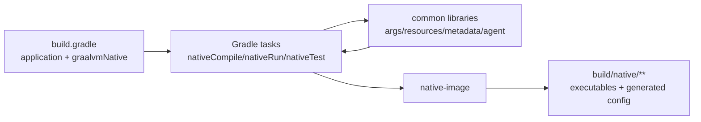

# FS-gradle-plugin: The Gradle plugin wires Native Image behavior into Gradle builds

The `native-gradle-plugin` module provides the Gradle plugin identified as
`org.graalvm.buildtools.native`. A Gradle user applies it to a Java project, configures native
image options in the `graalvmNative` DSL, and runs Gradle tasks such as `nativeCompile`,
`nativeRun`, `nativeTest`, and `metadataCopy`. The plugin turns those Gradle concepts into the
shared Native Build Tools behavior defined by §FS-plugin-common-behavior, while keeping Gradle
task names, inputs, outputs, providers, and configuration-cache behavior predictable. This
functional contract realizes §GOAL-gradle-plugin-native-image-workflows under
§GRUND-gradle-plugin-purpose and keeps Gradle behavior aligned through
§GOAL-gradle-plugin-behavior-stays-aligned-with-shared-contract. It depends on
§FS-common-libraries and §FS-native-tests-and-fixtures, and is constrained by
§REQ-gradle-plugin-gradle-model-compatibility and §REQ-gradle-plugin-task-surface-stability.

## At a Glance

| User wants to... | They configure | They run | Main output |
| --- | --- | --- | --- |
| Build the application image | `application { mainClass = ... }` and `graalvmNative.binaries.main` | `./gradlew nativeCompile` | `build/native/nativeCompile/<imageName>` |
| Run the application image | runtime args on the `main` binary or `nativeRun` task | `./gradlew nativeRun` | native process result |
| Build native tests | normal Gradle `test` source set plus optional `graalvmNative.binaries.test` | `./gradlew nativeTestCompile` | `build/native/nativeTestCompile/<imageName>` |
| Run native tests | JUnit test setup and native test options | `./gradlew nativeTest` | Gradle test task success/failure |
| Generate resource config | binary resource settings | `./gradlew generateResourcesConfigFile` | generated `resource-config.json` under `build/native/` |
| Use reachability metadata | `graalvmNative.metadataRepository` | `./gradlew nativeCompile` | selected metadata passed to Native Image |
| Collect agent metadata | `graalvmNative.agent` or `-Pagent` | JVM task/test, then `./gradlew metadataCopy` | copied or merged metadata files |



The rest of this file is the normative contract behind those user workflows. It keeps the
high-level task names stable while giving code and tests narrow citation targets such as
§FS-gradle-plugin.2.1 for compile tasks or §FS-gradle-plugin.5.5 for metadata copy.

## 1. Plugin activation and Gradle model

The plugin should feel like a normal Gradle Java plugin extension. Users opt in with one plugin ID,
then configure native builds beside their existing `application`, `java-library`, source set, and
test configuration.

### 1.1 Plugin identity

The plugin ID is `org.graalvm.buildtools.native`. Applying it alone must not force a Java model into
the project. Java-dependent native tasks are registered when a Java plugin is present, so projects
can apply plugins in either order without depending on accidental eager configuration.

### 1.2 Extension surface

The plugin must expose a `graalvmNative` extension. This is the durable Gradle DSL surface for
native binaries, Native Image options, generated resources, reachability metadata, native tests,
and tracing-agent workflows from §FS-plugin-common-behavior.

For a typical application, users configure the same binary that `nativeCompile` builds:

```groovy
graalvmNative {
    binaries {
        main {
            imageName = 'demo'
            buildArgs.add('--verbose')
            quickBuild = true
        }
    }
}
```

That DSL must feed the same option objects consumed by compile, run, resource-generation,
metadata, and native-test tasks. A user should not have to repeat `imageName`, `mainClass`,
`buildArgs`, metadata directories, or resource settings separately on each task.

### 1.3 Default binaries

For Java application projects, the plugin must create a `main` binary. Its `mainClass` convention
comes from Gradle's `application` extension when available:

```groovy
plugins {
    id 'application'
    id 'org.graalvm.buildtools.native'
}

application {
    mainClass.set('com.example.Main')
}
```

With that setup, `./gradlew nativeCompile` builds the application image and `./gradlew nativeRun`
runs it. For Java library projects, the main binary defaults to shared-library output. The plugin
must also create a `test` binary connected to the default `test` task and `test` source set so
`./gradlew nativeTest` can build and run native JUnit tests without a separate binary declaration.

### 1.4 Custom binaries

Users may add entries to the `binaries` container for extra source sets or entry points. Each entry
must create matching compile and run tasks, using predictable task names derived from the binary
name. Custom binaries apply the shared native image build contract from
§FS-plugin-common-behavior.2 without forcing users outside the plugin's option model.

### 1.5 Practical activation flow

A minimal user flow is:

```bash
./gradlew nativeCompile
./gradlew nativeRun
```

The first command compiles `build/native/nativeCompile/<imageName>` from the configured `main`
binary. The second command depends on that image and executes it with runtime arguments configured
on the same binary. If a build uses tests, `./gradlew nativeTest` compiles the test image under
`build/native/nativeTestCompile/` and executes it through the native test launcher.

## 2. Native image task behavior

Native image tasks are the user-facing Gradle commands for building, running, and experimenting
with native executables. They adapt the shared build contract in §FS-plugin-common-behavior.2 to
Gradle task inputs and outputs.

### 2.1 Compile tasks

`nativeCompile` builds the `main` binary. It consumes the binary classpath, main class or
shared-library setting, build arguments, configuration file directories, generated resources,
reachability metadata, optional classpath JAR, argument-file setting, layer and PGO options,
environment variables, system properties, and JVM arguments.

`nativeTestCompile` builds the native test binary described by §FS-native-tests-and-fixtures. It
uses compiled test classes, test resources, the test runtime classpath, JUnit native support,
selected test identifiers, and the `test` binary options. It is valid to run only this task when a
user wants to inspect or execute the compiled test image separately.

Every custom binary must receive a derived `native<Binary>Compile` task. All compile tasks must
declare Gradle inputs and outputs for the selected options and generated files so Gradle can skip,
cache, or rerun them consistently.

### 2.2 Run tasks

`nativeRun` executes the output of `nativeCompile` for the `main` binary. It passes runtime
arguments from the binary configuration and sets up layer library paths when layered Native Image
output is used. Custom runnable binaries receive matching derived run tasks that execute their own
compile-task output.

`nativeTest` executes the output of `nativeTestCompile` unless native test execution is skipped.
The native test process result is the Gradle task result: a failing native test executable must
fail the build.

### 2.3 Deprecated task aliases

The plugin must keep compatibility aliases for deprecated task names where they still exist. An
alias should depend on the replacement task and warn users to use the current name, protecting
§REQ-gradle-plugin-task-surface-stability.

### 2.4 Command-line overrides

Users can try one-off Native Image settings without editing `build.gradle`:

```bash
./gradlew nativeCompile --quick-build-native --verbose --image-name demo-dev
./gradlew nativeCompile --build-args=--initialize-at-build-time=com.example
./gradlew nativeCompile --force-build-args=--no-fallback
```

Compile tasks must expose task options for image name, main class, debug, verbose, fallback,
quick build, rich output, PGO instrumentation, build args, forced build args, fat JAR mode,
system properties, environment variables, JVM args, and forced JVM args. These overrides must feed
the same option objects as the DSL, keeping command-line experimentation aligned with
§FS-plugin-common-behavior.6.

### 2.5 Override precedence

Command-line task options and `-P` controls override DSL configuration for a single invocation
rather than merging with it. A setter such as `--image-name` calls `set(...)` on the same property
the DSL populates, so the command-line value replaces the DSL value for that build.

Build arguments are the documented exception: `--build-args` appends to configured arguments,
while `--force-build-args` replaces them. The `-Pagent` property overrides the configured agent
default mode as in §FS-gradle-plugin.5.1. Because every source writes to one option object,
behavior depends on the final value, not on whether the value came from DSL or the command line.

### 2.6 Commands users run

The main commands exposed by the plugin are:

```bash
./gradlew nativeCompile
./gradlew nativeRun
./gradlew nativeTestCompile
./gradlew nativeTest
./gradlew generateResourcesConfigFile
./gradlew collectReachabilityMetadata
./gradlew listLibrariesMissingMetadata
./gradlew metadataCopy
```

These tasks should be discoverable through normal Gradle task listing and usable in CI without
special wrapper scripts. Their outputs should stay under `build/native/` so generated Native Image
state is separate from regular Java compilation output.

## 3. Native Image invocation

Native Image invocation is the part that finds `native-image`, checks whether the requested build
can run, assembles the command line, and starts the process.

### 3.1 Executable discovery

Compile and metadata tasks must find `native-image` from the configured Gradle Java launcher or
toolchain when toolchain detection is enabled. When detection is disabled or no launcher supplies
Native Image, the plugin must use GraalVM/JDK environment and path fallbacks. Failure messages must
tell the user which lookup path was attempted.

### 3.2 Version and schema gates

When users configure a required Native Image version, compile tasks must check the discovered
version before building. When reachability metadata is enabled, tasks must validate repository
metadata against the schema expected by the discovered Native Image major version before passing
that metadata to `native-image`.

### 3.3 Command-line construction

The command line must combine classpath, module path where applicable, output name, main class,
boolean image flags, build arguments, JVM arguments, system properties, environment variables,
configuration directories, generated resources, reachability metadata, layer options
(§GLOSS-layered-image), and PGO options (§GLOSS-pgo). Shared escaping and argument-file conversion
must come from common utilities rather than Gradle-only string handling, keeping Gradle aligned
with §FS-plugin-common-behavior.6.

### 3.4 Argument files

The plugin must support Native Image argument files for command lines that should not be passed as
plain process arguments. Argument-file generation must preserve argument semantics and use paths
relative to the selected working directory where Native Image requires that form.

### 3.5 Classpath JAR and artifact analysis

When configured to use a classpath JAR, the compile task must pass the generated JAR instead of an
exploded classpath. The plugin may analyze runtime classpath JARs through Gradle artifact
transforms to discover packages and resource behavior, but that transform output is an internal
detail. The fat-jar form is defined in §GLOSS-fat-jar.

### 3.6 Parallel native builds

The plugin must limit concurrent Native Image builds through a Gradle build service. Users can set
the limit with `org.graalvm.buildtools.max.parallel.builds` or
`GRAALVM_BUILDTOOLS_MAX_PARALLEL_BUILDS`; otherwise the plugin chooses a conservative default from
available processors.

## 4. Resources and reachability metadata

Gradle users should be able to include resources and reachability metadata without learning every
Native Image configuration file by hand. The plugin exposes the shared metadata and resource
contracts in §FS-plugin-common-behavior.4 and §FS-common-libraries as Gradle DSL and tasks.

### 4.1 Resource autodetection

When a binary enables resource autodetection, the plugin must scan that binary's runtime classpath
and generate a Native Image `resource-config.json`. If a classpath entry already contains Native
Image resource configuration and existing configuration should not be ignored, the plugin must not
duplicate resources from that entry.

The main binary resource task is `generateResourcesConfigFile`. Custom binaries receive
`generate<Binary>ResourcesConfigFile` tasks. The test binary's generated resource task contributes
to `nativeTestCompile`.

### 4.2 Generated resource configuration

Generated resource configuration must be placed under the configured generated-resources directory
and added to the binary's configuration file directories so the compile task consumes it
automatically. Users should not need to manually copy generated `resource-config.json` files into
`src/main/resources/META-INF/native-image`.

### 4.3 Reachability metadata collection

`collectReachabilityMetadata` resolves metadata for the runtime classpath from the configured
metadata repository URI, version, exclusions, and module-to-config-version overrides. Its output
directory must be consumable by native compile tasks and must contain only metadata selected for
the binary's dependency graph.

### 4.4 Missing metadata reports

`listLibrariesMissingMetadata` inspects direct runtime dependencies, compares them with the
configured reachability metadata repository, writes a JSON report, and may create GitHub issues
when issue-creation settings are supplied. The task reports missing metadata without modifying the
native compile task inputs.

### 4.5 Dynamic access metadata

When a binary is configured to emit a Native Image build report, the plugin must generate
dynamic-access metadata before invoking Native Image. The task uses the configured reachability
metadata repository and runtime classpath graph, then makes the result available as generated
Native Image configuration. The metadata is defined in §GLOSS-dynamic-access-metadata.

The main binary task is `generateDynamicAccessMetadata`; custom binaries receive
`generate<Binary>DynamicAccessMetadata`. The task output is added to the binary's classpath only
when the binary requests a Native Image build report.

### 4.6 Metadata examples

A project can opt into repository metadata and apply exclusions directly in the DSL:

```groovy
graalvmNative {
    metadataRepository {
        enabled = true
    }
    binaries.all {
        excludeConfig.put("com.example:library:1.0", [".*"])
    }
}
```

With that setup, `./gradlew nativeCompile` collects selected repository metadata before invoking
Native Image. `./gradlew listLibrariesMissingMetadata` gives maintainers a separate report for
dependencies that are not covered, which is useful before deciding whether to add agent-generated
configuration or upstream metadata.

## 5. Native Image tracing agent

The Gradle plugin must make the Native Image tracing agent available without requiring users to
edit JVM task command lines by hand. This realizes the shared tracing-agent workflow in
§FS-plugin-common-behavior.5.

### 5.1 Agent enablement

The agent can be enabled by DSL configuration or with the `-Pagent` Gradle property. When the
property names a mode, that mode must override the configured default mode for the instrumented
run.

### 5.2 Instrumented tasks

Every task that implements `JavaForkOptions` is eligible for instrumentation. The
`tasksToInstrumentPredicate` setting may narrow that set. Non-matching tasks must be skipped
without failing the build.

### 5.3 Agent modes

The Gradle DSL must expose standard, conditional, direct, and disabled agent modes using the
shared agent mode behavior from §FS-common-libraries.3. Conditional mode must support user-code and
extra filters; direct mode must allow users to pass native agent options, including `{output_dir}`
substitution.

### 5.4 Agent output layout

Agent output must be written under `build/native/agent-output/<taskName>` unless users configure a
direct mode output location. Generated output must be suitable for later merge and copy steps.

### 5.5 Metadata copy

`metadataCopy` copies or merges agent output from configured input tasks into configured output
directories. Command-line options on `metadataCopy` may select task names and destination
directories for ad hoc use, exposing the shared agent post-processing workflow from
§FS-plugin-common-behavior.5.

### 5.6 Agent example

A user can collect metadata from JVM tests and copy it into a project directory:

```groovy
graalvmNative {
    agent {
        defaultMode = "standard"
        metadataCopy {
            mergeWithExisting = true
            inputTaskNames.add("test")
            outputDirectories.add("build/native/metadataCopyTest")
        }
    }
}
```

```bash
./gradlew nativeTest -Pagent
./gradlew metadataCopy
```

The first command runs the selected JVM or native test workflow with the tracing agent. The second
command copies or merges the generated files from `build/native/agent-output/test` into the
configured output directory.

## 6. Native tests

Gradle native tests let users keep their normal JUnit test source set and ask the plugin to build
and execute those tests as a native image. Runtime semantics are defined by
§FS-plugin-common-behavior.3 and §FS-native-tests-and-fixtures.

### 6.1 Test task integration

The default `test` binary must derive its classes, resources, classpath, test identifiers, and JUnit
support from the Gradle `test` source set and `test` task. A normal JUnit setup should therefore be
enough:

```groovy
dependencies {
    testImplementation("org.junit.jupiter:junit-jupiter")
    testRuntimeOnly("org.junit.platform:junit-platform-launcher")
}

test {
    useJUnitPlatform()
}
```

### 6.2 Native test execution

`nativeTestCompile` builds the native test image. `nativeTest` runs that image unless the test
support DSL disables native testing or the requested task graph only builds the test image. Native
test failures must fail the Gradle build in the same way Java test failures do.

### 6.3 Compatibility mode

When Native Image compatibility mode is detected, Gradle native test behavior may use the original
JUnit ConsoleLauncher path rather than the Native Build Tools launcher path, as described by
§FS-native-tests-and-fixtures.5.

### 6.4 Native test commands

The practical commands are:

```bash
./gradlew nativeTestCompile
./gradlew nativeTest
```

`nativeTestCompile` is useful when debugging image generation. `nativeTest` is the command for
continuous integration: it compiles the test image, executes it, and reports failures through
Gradle.

## 7. Verification surface

The module's unit tests must cover task and plugin behavior that can be exercised without running
full sample builds. Functional tests must exercise sample projects through Gradle TestKit and the
repository's common test repository. Required scenario families include Java applications, Java
libraries, Kotlin tests, custom source sets, multi-project tests, resources, reflection, metadata
repository integration, agent collection, reachability metadata, Native Image options, and layered
applications. These fixtures are owned by §AR-native-tests-and-fixtures.1.
